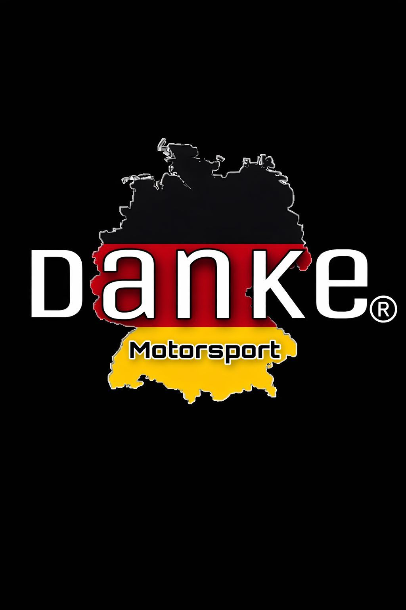

# Danke Motorsport - Plataforma de Agendamento Premium

<p align="center">
  
</p>

> **UM NOVO CONCEITO EM REPARAÇÃO PREMIUM**
> *Projeto full-stack desenvolvido para modernizar a captação de leads e a gestão de agendamentos de uma oficina mecânica especializada.*

---

## Sobre o Projeto

Este projeto é fruto de um trabalho prático do curso de **Sistemas de Informação na UFSC**. O objetivo principal é desenvolver um sistema web de ponta a ponta para resolver uma dor real de negócios: a centralização e otimização de agendamentos de serviços automotivos, que hoje ocorrem exclusivamente via WhatsApp.

O sistema visa impulsionar a captação de leads e facilitar a gestão da agenda para uma oficina em pleno crescimento, entregando uma experiência digital à altura do padrão premium dos veículos atendidos.

## O Cliente: Danke Motorsport

Localizada na região de Palhoça/São José (Santa Catarina), a **Danke Motorsport** é uma oficina mecânica focada em veículos de alto padrão.

Seu diferencial de mercado é a altíssima expertise técnica dos fundadores:
* **Automóveis de Luxo:** Gestão liderada por um profissional com 10 anos de experiência como gerente de pós-vendas na DVA Mercedes-Benz, com foco em marcas como Mercedes, BMW e Volvo.
* **Motocicletas Premium:** Liderança técnica com vasta experiência como gerente da BMW Motos, dominando a mecânica de motos de alta cilindrada (500cc+), especialmente a linha Big Trail (ex: GS 1200).

---

## Stack Tecnológica

A arquitetura do projeto separa claramente as responsabilidades de interface e regra de negócio:

| Camada | Tecnologia |
|---|---|
| Front-end | React 19 + Vite + React Router DOM |
| Back-end (API) | C# .NET 10 (ASP.NET Core Web API) |
| ORM | Entity Framework Core |
| Banco de Dados | PostgreSQL hospedado no Supabase |
| Deploy Frontend | Vercel *(em breve)* |

---

## Arquitetura do Projeto

```
Danke-Motorsport/
├── frontend/          # Aplicação React (Vite)
│   ├── src/
│   │   ├── components/    # Componentes reutilizáveis (Navbar, etc.)
│   │   ├── pages/         # Páginas (LandingPage, Auth, etc.)
│   │   ├── routes/        # Configuração de rotas
│   │   └── assets/        # Variáveis CSS globais
│   └── package.json
│
└── backend/           # API REST em C# .NET
    ├── Controllers/       # Endpoints da API
    ├── Models/            # Entidades do banco (Cliente, Funcionario, Revisao)
    ├── Data/              # AppDbContext (EF Core)
    └── Migrations/        # Histórico de migrations do banco
```

---

## Funcionalidades Principais (MVP)

* **Para o Cliente:** Landing page responsiva, cadastro e login, formulário de agendamento de revisões/diagnósticos e acompanhamento de status.
* **Para o Funcionário:** Dashboard Kanban para gestão de revisões agendadas, atualização de status e atribuição de tarefas.

---

## Pré-requisitos

Antes de executar o projeto localmente, você precisará ter instalado:

* [Node.js](https://nodejs.org/) (v18 ou superior) e npm
* [.NET SDK 10](https://dotnet.microsoft.com/download)
* Acesso ao banco de dados PostgreSQL (via Supabase ou instância local)

Para instruções detalhadas de execução, consulte o arquivo [`setup.xml`](./setup.xml) na raiz do projeto.

---

## Execução Local (Resumo)

### Backend
```bash
cd backend
# Configure as variáveis de conexão (veja setup.xml)
dotnet restore
dotnet ef database update
dotnet run
# API disponível em: http://localhost:5000
```

### Frontend
```bash
cd frontend
npm install
npm run dev
# App disponível em: http://localhost:5173
```

---

## Deploy

| Serviço | Plataforma | Status |
|---|---|---|
| Frontend | Vercel | 🔜 Em breve |
| Backend | A definir (Railway / Render) | 🔜 Em breve |
| Banco de Dados | Supabase (PostgreSQL) | ✅ Ativo |

---

## Integrantes da Equipe

Desenvolvido por estudantes de graduação em Sistemas de Informação - UFSC:

* David
* Eduardo
* Gustavo
* Johan
* Jonathan

---

*Acompanhe a Danke Motorsport no Instagram: [@dankemotorsport](https://www.instagram.com/dankemotorsport/)*