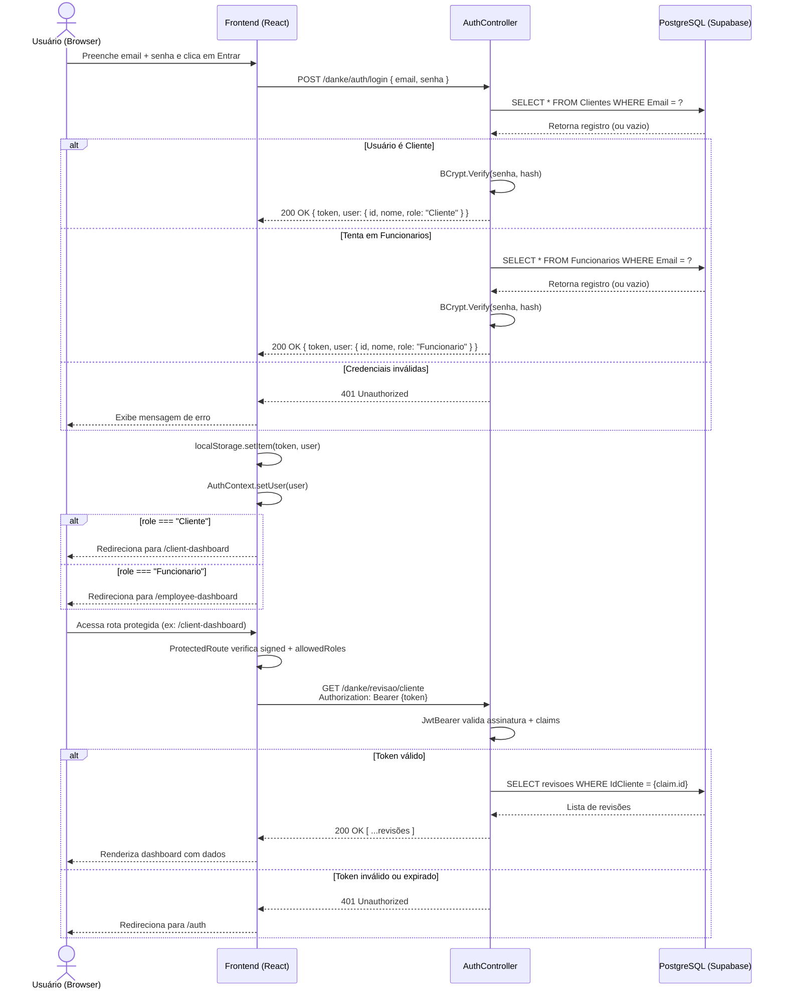

# Danke Motorsport - Plataforma de Agendamento Premium

<p align="center">
  
</p>

> **UM NOVO CONCEITO EM REPARAÇÃO PREMIUM**
> *Projeto full-stack desenvolvido para modernizar a captação de leads e a gestão de agendamentos de uma oficina mecânica especializada.*

---

## Sobre o Projeto

Este projeto é fruto de um trabalho prático do curso de **Sistemas de Informação na UFSC**. O objetivo principal é desenvolver um sistema web de ponta a ponta para resolver uma dor real de negócios: a centralização e otimização de agendamentos de serviços automotivos, que hoje ocorrem exclusivamente via WhatsApp.

O sistema visa impulsionar a captação de leads e facilitar a gestão da agenda para uma oficina em pleno crescimento, entregando uma experiência digital à altura do padrão premium dos veículos atendidos.

## O Cliente: Danke Motorsport

Localizada na região de Palhoça/São José (Santa Catarina), a **Danke Motorsport** é uma oficina mecânica focada em veículos de alto padrão.

Seu diferencial de mercado é a altíssima expertise técnica dos fundadores:
* **Automóveis de Luxo:** Gestão liderada por um profissional com 10 anos de experiência como gerente de pós-vendas na DVA Mercedes-Benz, com foco em marcas como Mercedes, BMW e Volvo.
* **Motocicletas Premium:** Liderança técnica com vasta experiência como gerente da BMW Motos, dominando a mecânica de motos de alta cilindrada (500cc+), especialmente a linha Big Trail (ex: GS 1200).

---

## Stack Tecnológica

A arquitetura do projeto separa claramente as responsabilidades de interface (Front-end) e regra de negócio (Back-end):

| Camada | Tecnologia Principal | Bibliotecas & Detalhes |
|---|---|---|
| **Front-end** | React 19 + Vite + React Router DOM | Axios, React Hot Toast, React Icons, React IMask, Google Maps (iframe embed) |
| **Back-end (API)** | C# .NET 10 (ASP.NET Core Web API) | Entity Framework Core, Npgsql, JWT Bearer, BCrypt.Net-Next, Swashbuckle (Swagger) |
| **Banco de Dados** | PostgreSQL | Hospedado no Supabase |
| **Hospedagem & Deploy** | Vercel (Front-end) e Railway (Back-end) | Deploy automático integrado com GitHub |

### Detalhes do Front-end
* **React 19 & Vite:** Interface modular baseada em componentes com tempo de inicialização e build otimizados.
* **React Router DOM:** Gerenciamento dinâmico de rotas e segurança das páginas restritas.
* **Axios:** Cliente HTTP para comunicação com a API, responsável por anexar o token JWT às requisições autenticadas.
* **React Hot Toast:** Exibição de alertas não-bloqueantes para confirmações e erros.
* **React Icons:** Conjunto padronizado de ícones para toda a interface.
* **React IMask:** Inclusão de máscaras de digitação para dados sensíveis (CPF e telefone) nas telas de cadastro e alteração de perfil.
* **Integração com Mapas (Google Maps):**
  * Não é utilizada biblioteca npm de mapas externa.
  * A localização física da oficina em Palhoça/SC é apresentada por meio de um `iframe embed` do Google Maps inserido na Landing Page.
  * **Responsividade:** Em telas grandes (Desktop), o mapa se posiciona ao lado do texto descritivo. Em telas móveis (Mobile), o mapa se ajusta de maneira fluida ocupando a largura total do display abaixo da seção informativa.

### Detalhes do Back-end
* **ASP.NET Core (Web API):** Criação de endpoints REST estruturados e altamente performáticos.
* **Entity Framework Core (EF Core) & Npgsql:** Mapeamento objeto-relacional para consultas e manipulação direta do banco PostgreSQL.
* **JWT Bearer:** Geração de chaves e autorização de tokens de acesso para segurança de sessão.
* **BCrypt.Net-Next:** Criptografia de senhas por meio de hash antes do armazenamento no banco de dados.
* **Swashbuckle (Swagger):** Exposição e testes rápidos dos endpoints da API em ambiente de desenvolvimento.

---

## Responsividade

A responsividade do sistema foi implementada integralmente com **CSS puro (Vanilla CSS)**, sem o auxílio de frameworks utilitários de terceiros.
* **Breakpoints:** Adaptabilidade configurada através de Media Queries (`@media`) sob as resoluções de `576px`, `768px` e `992px`.
* **Flexbox & CSS Grid:** Utilizados para a reorganização automática do fluxo visual:
  * **Landing Page:** Exibição horizontal (lado a lado) em telas de desktop, transicionando para empilhamento vertical em telas de smartphones.
  * **Dashboards:** Seções e tabelas adaptam suas colunas de dados para blocos únicos de visualização em displays pequenos.
  * **Navbar:** Readequação de espaçamentos internos e alinhamento dos links em aparelhos celulares, prevenindo quebras.

---

## Arquitetura do Projeto

```
Danke-Motorsport/
├── frontend/          # Aplicação React (Vite)
│   ├── src/
│   │   ├── components/    # Componentes reutilizáveis (Navbar, etc.)
│   │   ├── pages/         # Páginas (LandingPage, Auth, dashboards, etc.)
│   │   ├── routes/        # Configuração de rotas
│   │   ├── services/      # Cliente HTTP (Axios)
│   │   ├── styles/        # CSS compartilhado (Swiss Design)
│   │   ├── utils/         # Helpers (rotas de auth, validação de agendamento)
│   │   └── assets/        # Variáveis CSS globais
│   └── package.json
│
└── backend/           # API REST em C# .NET
    ├── Controllers/       # Endpoints da API
    ├── Models/            # Entidades do banco (Cliente, Funcionario, Revisao)
    ├── Services/          # Regras de negócio reutilizáveis (ex.: validação de agendamento)
    ├── Data/              # AppDbContext (EF Core)
    └── Migrations/        # Histórico de migrations do banco
```

---

## Fluxo de Autenticação

O sistema utiliza JWT Bearer Authentication. O diagrama abaixo descreve o fluxo completo desde o login até o acesso a um endpoint protegido:



### Detalhes de Segurança e Autenticação

* **Hash de Senha (BCrypt):**
  * As senhas dos usuários nunca são salvas em texto puro no banco de dados.
  * No cadastro e na atualização de dados de perfil, o backend aplica `BCrypt.HashPassword` para gerar um hash criptográfico seguro.
  * No momento do login, o método `BCrypt.Verify` realiza a verificação comparando a senha informada com o hash guardado.
  * O mesmo algoritmo é adotado em todas as etapas e endpoints da API de backend.
* **Autenticação Baseada em JWT:**
  * O login gera um token JWT criptografado com validade de **7 dias**.
  * O frontend armazena o token recebido no `localStorage` do navegador para manter a sessão ativa.
  * Todas as chamadas à API que requerem autorização enviam o token no cabeçalho `Authorization: Bearer {token}` de forma automatizada via Axios.
  * O backend valida a assinatura do token e extrai as *claims* de acesso, validando a role correspondente (`Cliente`, `Funcionario` ou `Admin`).

---

## Funcionalidades Principais (MVP)

* **Para o Cliente:** Landing page responsiva, cadastro e login, formulário de agendamento de revisões/diagnósticos e acompanhamento de status.
* **Para o Funcionário:** Dashboard Kanban para gestão de revisões agendadas, atualização de status e atribuição de tarefas.
* **Para o Admin:** Painel com visão geral, gestão de clientes, funcionários e revisões.

### Planos de revisão

Cada agendamento é associado a um dos três planos, identificados visualmente por badges com cores distintas:

| Plano | Tipo | Descrição resumida |
|---|---|---|
| **Bronze** | 1 | Revisão básica de segurança e fluidos essenciais |
| **Silver** | 2 | Revisão completa — suspensão, freios e motor |
| **Gold** | 3 | Diagnóstico eletrônico avançado e ajustes finos |

### Regras de agendamento

Agendamentos são validados no **frontend** e no **backend** (`AgendamentoValidator`):

* Não é permitido marcar horários no **passado**.
* Horário comercial: **08:00 às 18:00** (fuso `America/Sao_Paulo`).
* Mensagens de erro são exibidas ao cliente e ao administrador ao tentar salvar um horário inválido.

---

## Pré-requisitos

Antes de executar o projeto localmente, você precisará ter instalado:

* [Node.js](https://nodejs.org/) (v18 ou superior) e npm — ou [Docker](https://docs.docker.com/get-docker/) + Docker Compose
* [.NET SDK 10](https://dotnet.microsoft.com/download) — apenas se rodar sem Docker
* Acesso ao banco de dados PostgreSQL (via Supabase ou instância local)

Para instruções detalhadas de execução, consulte o arquivo [`setup.xml`](./setup.xml) na raiz do projeto.

---

## Execução Local (Docker Compose — recomendado)

```bash
cp .env.development.example .env.development
# Edite .env.development com connection string, JWT e demais valores
docker compose up --build
```

| Serviço | URL |
|---|---|
| Frontend | http://localhost:5173 |
| Backend API | http://localhost:8080 |
| Swagger | http://localhost:8080/swagger |

No Docker, o frontend **não chama o backend diretamente pelo browser**. O Vite faz proxy das rotas `/danke` e `/health` para o serviço `backend:8080` dentro da rede do Compose. Por isso, no `docker-compose.yml`, `VITE_API_URL` fica vazio e `API_PROXY_TARGET=http://backend:8080` é usado apenas pelo servidor de desenvolvimento do Vite.

Se aparecer *"Não foi possível conectar à API"*, verifique:

1. Se o container `backend` está **healthy** (`docker compose ps`).
2. Se a porta **8080** está publicada no host (recrie com `docker compose up -d --force-recreate backend` se necessário).
3. Se `.env.development` tem `ConnectionStrings__DefaultConnection`, `Jwt__Key` (32+ caracteres) e `AllowedOrigins__0=http://localhost:5173`.

Migrations (quando necessário):

```bash
docker compose run --rm backend dotnet ef database update
```

---

## Execução Local (manual, sem Docker)

### Backend
```bash
cd backend
# Configure variáveis (veja .env.development.example ou setup.xml)
dotnet restore
dotnet ef database update
dotnet run
# API disponível em: http://localhost:8080
```

### Frontend
```bash
cd frontend
npm install
npm run dev
# App disponível em: http://localhost:5173
```

Em dev manual (sem Docker), o Vite também faz proxy de `/danke` para `http://localhost:8080`. Você pode deixar `VITE_API_URL` vazio ou definir `VITE_API_URL=http://localhost:8080` em `frontend/.env.local` se preferir chamar a API diretamente.

---

## Deploy em Produção

Produção usa três serviços: **Vercel** (frontend), **Railway** (backend) e **Supabase** (PostgreSQL). Deploys automáticos vêm apenas da branch `production`.

### Política de branches

| Branch | Uso |
|---|---|
| `main` | Desenvolvimento |
| `production` | Deploy de produção (Vercel + Railway) |

### Variáveis de ambiente

**Railway (backend)**

| Variável | Exemplo |
|---|---|
| `ASPNETCORE_ENVIRONMENT` | `Production` |
| `ConnectionStrings__DefaultConnection` | string do Supabase (produção) |
| `Jwt__Key` | segredo com 32+ caracteres |
| `AllowedOrigins__0` | `https://<app>.vercel.app` |

**Vercel (frontend)**

| Variável | Exemplo | Observação |
|---|---|---|
| `VITE_API_URL` | `https://<backend>.up.railway.app` | Obrigatória em produção (sem proxy do Vite) |

**Desenvolvimento local (`.env.development`)**

| Variável | Docker Compose | Dev manual |
|---|---|---|
| `VITE_API_URL` | vazio (proxy do Vite) | vazio ou `http://localhost:8080` |
| `API_PROXY_TARGET` | `http://backend:8080` | não necessário |
| `AllowedOrigins__0` | `http://localhost:5173` | `http://localhost:5173` |

### Banco de dados (primeira vez)

1. Crie um projeto Supabase de produção.
2. Aplique as migrations a partir de uma máquina confiável:

```bash
cd backend
ConnectionStrings__DefaultConnection="<supabase-production-url>" dotnet ef database update
```

3. Crie o primeiro funcionário/admin com SQL único no Supabase SQL Editor. Gere o hash BCrypt localmente (mesma lib do backend) e execute:

```sql
INSERT INTO funcionarios (nome_funcionario, tipo_funcionario, cargo, email, senha)
VALUES ('Admin', 1, 1, 'admin@exemplo.com', '<bcrypt-hash>');
```

4. Confirme as tabelas: `clientes`, `funcionarios`, `revisoes`, `__EFMigrationsHistory`.

### Ordem de configuração dos provedores

1. Faça push da branch `production` com o código pronto.
2. Configure Railway (`backend/`, Dockerfile, health check `/health`) e obtenha a URL pública.
3. Configure Vercel (`frontend/`, `VITE_API_URL` apontando para Railway).
4. Atualize `AllowedOrigins__0` no Railway com a URL exata do Vercel e reinicie o backend.

### Rollback

- **Frontend/backend:** no painel Vercel ou Railway, faça redeploy de um deployment anterior estável.
- **Banco:** migrations são irreversíveis em produção sem plano explícito; teste migrations em staging antes de aplicar.

### Smoke tests pós-deploy

- `GET https://<railway-domain>/health` retorna 200.
- Rotas diretas: `/`, `/auth`, `/client-dashboard`, `/employee-dashboard`.
- Cadastro e login de cliente; login de funcionário; criar e atualizar revisão.
- Console do navegador sem erros de CORS ou mixed content.

Para o passo a passo completo (local e produção), consulte [`setup.xml`](./setup.xml).

### Keep-Alive do Banco (Supabase)

Como a plataforma gratuita do Supabase suspende e pausa o banco de dados PostgreSQL após um período de inatividade, foi implementado um mecanismo automatizado de keep-alive:
* **Workflow do GitHub Actions:** Localizado em `.github/workflows/keepalive.yml`.
* **Frequência:** Executado automaticamente a cada **5 dias às 00:00 UTC** via agendamento (`cron: 0 0 */5 * *`).
* **Acionamento Manual:** Também pode ser ativado a qualquer momento na aba *Actions -> Keep Supabase Alive -> Run workflow* do repositório no GitHub.
* **Funcionamento:** O job instala o utilitário `psql` no ambiente de CI e executa um comando simples de ping (`SELECT 1;`) no banco de dados, o que reativa o PostgreSQL do Supabase se ele estiver inativo ou evita que ele entre em hibernação, sem causar nenhuma modificação nos dados reais.
* **Segurança & Requisitos:** O fluxo necessita da variável secreta `SUPABASE_CONNECTION_STRING` (a connection string completa do Supabase) cadastrada nas secrets do repositório do GitHub. Caso a secret não esteja configurada, o workflow falhará acusando erro explicitamente.

---

## Integrantes da Equipe e Histórico de Contribuições

O projeto foi planejado e implementado por estudantes de graduação em Sistemas de Informação na UFSC. Detalhamento de commits e responsabilidades:

### Eduardo Steinbach
* **Estruturação:** Organizou a estrutura inicial de pastas e diretórios (backend e frontend).
* **Documentação:** Atualizou o arquivo README e elaborou a documentação XML da API.
* **Design Visual:** Realizou a centralização da logo do projeto no frontend.
* **Mapeamento de Dados:** Desenhou e configurou os modelos de banco de dados do Entity Framework Core.
* **API REST:** Codificou os primeiros controladores e rotas de backend.
* **Segurança:** Removeu credenciais/URLs fixas em arquivos de código e protegeu as rotas da API com anotações `[Authorize]`.
* **Organização e Refatoração:** Limpeza de arquivos desnecessários (move trash), criação da página "Sobre nós" e implementação do modal para confirmação de logout.

### Gustavo Dorow
* **Controle de Versão:** Criou o repositório no GitHub e definiu o arquivo `.gitignore`.
* **API Completa:** Desenvolveu o CRUD total na API para Clientes, Funcionários e Revisões.
* **Deploy de Produção:** Estruturou os arquivos de produção para Vercel e Railway, configurando Dockerfile, health checks, SPA routing e documentação relacionada.
* **UX/UI no Front:** Criou máscaras dinâmicas de CPF/Telefone no formulário, mensagens informativas em toasts, login automatizado imediatamente após cadastro e a tela de boas-vindas do sistema.
* **Variáveis de Ambiente:** Configurou o Docker Compose unificado com definições locais de `.env`.
* **Edição de Cadastro:** Criou e conectou o dashboard do cliente para alteração de informações pessoais.
* **Ajustes Técnicos:** Corrigiu a renderização de observações nas revisões, adicionou o mapa estático da localização física e ajustou componentes da Navbar.

### Johan Rodrigues
* **Estrutura Frontend:** Conduziu o setup inicial da aplicação React e mapeou as variáveis globais de estilização CSS (`:root`).
* **Componente Navbar:** Criou a barra de cabeçalho e navegação.
* **Página Principal:** Projetou e implementou a Landing Page institucional do cliente.
* **Páginas de Login/Cadastro:** Criou as interfaces e formulários de login e criação de conta.
* **Responsividade:** Aplicou técnicas de CSS responsivo para exibição consistente em dispositivos móveis.
* **Gestão Admin:** Criou o painel de dashboard exclusivo do Administrador.

### David Kauan
* **Segurança Backend:** Implementou a autenticação por token JWT, barreira de proteção de rotas e o job Keep-Alive.
* **CI/CD Fix:** Corrigiu o parsing da string de conexão de banco de dados no ambiente de CI.
* **Regras de Validação:** Adicionou restrição de e-mail exclusivo no cadastro de clientes e refinou configurações do Docker.
* **Parsing de Objetos:** Resolveu bugs de CORS e crashes na serialização JSON resultantes de ciclos de referências entre entidades.
* **Interação de Revisões:** Adicionou campos para envio de observações do cliente e de feedbacks detalhados escritos pelos mecânicos.

### Jonathan Tenório
* **Documentação:** Atualizou o arquivo README relacionando os membros do grupo.
* **Controle Admin:** Programou rotas e funcionalidades de controle do administrador dentro dos controllers de backend.
* **Resolução de Bugs:** Eliminou a barra preta presente no botão "Entrar", resolveu imports circulares no front e normalizou o scroll vertical na página de cadastro.
* **Polimento Visual:** Refatorou o visual completo dos painéis de controle, migrando-os para um design minimalista suíço (Swiss Design) alinhado com o branding oficial Danke.

---

*Acompanhe a Danke Motorsport no Instagram: [@dankemotorsport](https://www.instagram.com/dankemotorsport/)*