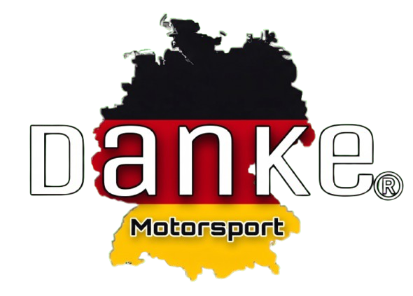

# Danke Motorsport - Plataforma de Agendamento Premium

<p align="center">
  
</p>

> **UM NOVO CONCEITO EM REPARAÇÃO PREMIUM**
> *Projeto full-stack desenvolvido para modernizar a captação de leads e a gestão de agendamentos de uma oficina mecânica especializada.*

---

## Trabalho Acadêmico — UFSC

Trabalho prático do curso de **Sistemas de Informação** (UFSC).


### Integrantes do grupo

| Nome | Matrícula |
|---|---|
| Eduardo Cacilha Steinbach | 25105628 |
| Gustavo Sonntag Dorow | 25100806 |
| Johan Akin Araújo da Silva Rodrigues | 25103312 |
| David Kauan Carneiro Pereira | 25103306 |
| Jonathan Tenório de Lima | 25102233 |

### Links

| | URL |
|---|---|
| **Repositório** | [https://github.com/danke-motorsports/danke-motorsport](https://github.com/danke-motorsports/danke-motorsport) |
| **Aplicação Web (24/7)** | [https://dankemotorsport.vercel.app/](https://dankemotorsport.vercel.app/) |


---

## Sobre o Projeto

Sistema web para a **Danke Motorsport**, oficina mecânica de Palhoça/São José (SC) especializada em veículos premium. Centraliza agendamentos de revisões (planos Bronze, Silver e Gold), substituindo o fluxo manual via WhatsApp, com dashboards para **Cliente**, **Funcionário** e **Admin**.

**Stack:** React 19 + Vite · ASP.NET Core 10 · PostgreSQL (Supabase) · deploy Vercel + Railway.

---

## Documentação

Detalhes técnicos, decisões de projeto e modelo de banco estão em [`docs/`](./docs/):

| Documento | Conteúdo |
|---|---|
| [Arquitetura](./docs/arquitetura.md) | Visão geral, fluxos, ambientes e deploy |
| [Frontend](./docs/frontend.md) | React, rotas, autenticação, UI |
| [Backend](./docs/backend.md) | API, JWT, regras de negócio |
| [Banco de Dados](./docs/banco-de-dados.md) | Schema, relacionamentos e migrations |

Instruções passo a passo de execução local e produção: [`setup.xml`](./setup.xml).

---

## Execução local (resumo)

**Pré-requisitos:** Docker + Docker Compose (ou Node.js 18+ e .NET SDK 10) e acesso a um PostgreSQL (Supabase).

```bash
cp .env.development.example .env.development
# Edite .env.development (connection string, JWT, CORS)
docker compose up --build
```

| Serviço | URL local |
|---|---|
| Frontend | http://localhost:5173 |
| API / Swagger | http://localhost:8080 · http://localhost:8080/swagger |

---

## Contribuições da equipe

> **Nota sobre o histórico de commits:** por conta de uma troca de repositório no GitHub, os commits de **Eduardo Cacilha Steinbach** não aparecem por completo na interface web do GitHub, mas permanecem registrados no histórico local do `.git`.

### Eduardo Cacilha Steinbach

- Estruturação inicial de pastas e diretórios (backend e frontend)
- Documentação README e documentação XML da API
- Centralização da logo no frontend
- Modelos de banco de dados (Entity Framework Core)
- Primeiros controladores e rotas REST
- Remoção de credenciais hardcoded e proteção de rotas com `[Authorize]`
- Página "Sobre nós" e modal de confirmação de logout

### Gustavo Sonntag Dorow

- Repositório GitHub e `.gitignore`
- CRUD completo de Clientes, Funcionários e Revisões na API
- Deploy de produção (Vercel, Railway, Dockerfile, health checks, SPA routing)
- Máscaras de CPF/telefone, toasts, login pós-cadastro e tela de boas-vindas
- Docker Compose unificado e variáveis de ambiente
- Dashboard do cliente para edição de perfil
- Mapa da localização da oficina e ajustes na Navbar

### Johan Akin Araújo da Silva Rodrigues

- Setup inicial React e variáveis CSS globais (`:root`)
- Componente Navbar
- Landing Page institucional
- Telas de login e cadastro
- Responsividade (CSS)
- Dashboard do Administrador

### David Kauan Carneiro Pereira

- Autenticação JWT, proteção de rotas e job Keep-Alive (Supabase)
- Correção de parsing da connection string no CI
- E-mail único no cadastro e configurações Docker
- Correção de CORS e serialização JSON (ciclos EF)
- Observações do cliente e feedback do mecânico nas revisões

### Jonathan Tenório de Lima

- Documentação README e relação dos integrantes
- Rotas e funcionalidades admin nos controllers
- Correções de UI (botão Entrar, imports circulares, scroll no cadastro)
- Refatoração visual dos dashboards (Swiss Design + branding Danke)

---

*Acompanhe a Danke Motorsport no Instagram: [@dankemotorsport](https://www.instagram.com/dankemotorsport/)*
