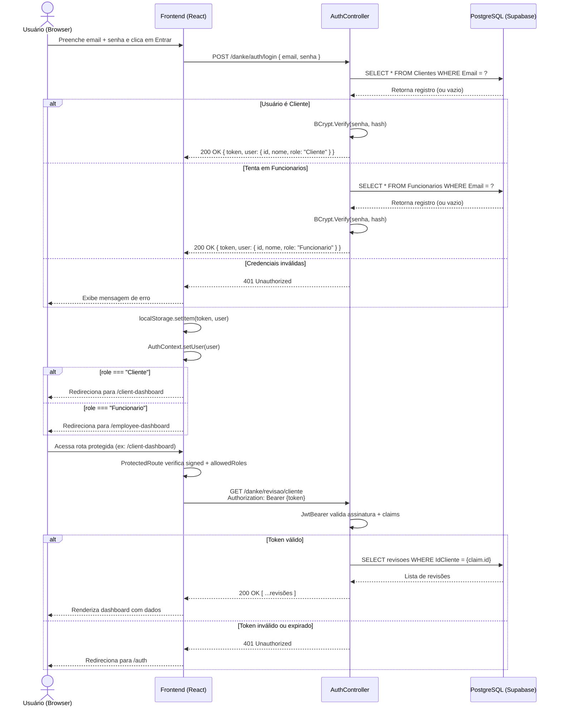

# Danke Motorsport - Plataforma de Agendamento Premium

<p align="center">
  
</p>

> **UM NOVO CONCEITO EM REPARAÇÃO PREMIUM**
> *Projeto full-stack desenvolvido para modernizar a captação de leads e a gestão de agendamentos de uma oficina mecânica especializada.*

---

## Sobre o Projeto

Este projeto é fruto de um trabalho prático do curso de **Sistemas de Informação na UFSC**. O objetivo principal é desenvolver um sistema web de ponta a ponta para resolver uma dor real de negócios: a centralização e otimização de agendamentos de serviços automotivos, que hoje ocorrem exclusivamente via WhatsApp.

O sistema visa impulsionar a captação de leads e facilitar a gestão da agenda para uma oficina em pleno crescimento, entregando uma experiência digital à altura do padrão premium dos veículos atendidos.

## O Cliente: Danke Motorsport

Localizada na região de Palhoça/São José (Santa Catarina), a **Danke Motorsport** é uma oficina mecânica focada em veículos de alto padrão.

Seu diferencial de mercado é a altíssima expertise técnica dos fundadores:
* **Automóveis de Luxo:** Gestão liderada por um profissional com 10 anos de experiência como gerente de pós-vendas na DVA Mercedes-Benz, com foco em marcas como Mercedes, BMW e Volvo.
* **Motocicletas Premium:** Liderança técnica com vasta experiência como gerente da BMW Motos, dominando a mecânica de motos de alta cilindrada (500cc+), especialmente a linha Big Trail (ex: GS 1200).

---

## Stack Tecnológica

A arquitetura do projeto separa claramente as responsabilidades de interface e regra de negócio:

| Camada | Tecnologia |
|---|---|
| Front-end | React 19 + Vite + React Router DOM |
| Back-end (API) | C# .NET 10 (ASP.NET Core Web API) |
| ORM | Entity Framework Core |
| Banco de Dados | PostgreSQL hospedado no Supabase |
| Deploy Frontend | Vercel |
| Deploy Backend | Railway |

---

## Arquitetura do Projeto

```
Danke-Motorsport/
├── frontend/          # Aplicação React (Vite)
│   ├── src/
│   │   ├── components/    # Componentes reutilizáveis (Navbar, etc.)
│   │   ├── pages/         # Páginas (LandingPage, Auth, etc.)
│   │   ├── routes/        # Configuração de rotas
│   │   └── assets/        # Variáveis CSS globais
│   └── package.json
│
└── backend/           # API REST em C# .NET
    ├── Controllers/       # Endpoints da API
    ├── Models/            # Entidades do banco (Cliente, Funcionario, Revisao)
    ├── Data/              # AppDbContext (EF Core)
    └── Migrations/        # Histórico de migrations do banco
```

---

## Fluxo de Autenticação

O sistema utiliza JWT Bearer Authentication. O diagrama abaixo descreve o fluxo completo desde o login até o acesso a um endpoint protegido:



---

## Funcionalidades Principais (MVP)

* **Para o Cliente:** Landing page responsiva, cadastro e login, formulário de agendamento de revisões/diagnósticos e acompanhamento de status.
* **Para o Funcionário:** Dashboard Kanban para gestão de revisões agendadas, atualização de status e atribuição de tarefas.

---

## Pré-requisitos

Antes de executar o projeto localmente, você precisará ter instalado:

* [Node.js](https://nodejs.org/) (v18 ou superior) e npm — ou [Docker](https://docs.docker.com/get-docker/) + Docker Compose
* [.NET SDK 10](https://dotnet.microsoft.com/download) — apenas se rodar sem Docker
* Acesso ao banco de dados PostgreSQL (via Supabase ou instância local)

Para instruções detalhadas de execução, consulte o arquivo [`setup.xml`](./setup.xml) na raiz do projeto.

---

## Execução Local (Docker Compose — recomendado)

```bash
cp .env.development.example .env.development
# Edite .env.development com connection string, JWT e demais valores
docker compose up --build
```

| Serviço | URL |
|---|---|
| Frontend | http://localhost:5173 |
| Backend API | http://localhost:8080 |
| Swagger | http://localhost:8080/swagger |

Migrations (quando necessário):

```bash
docker compose run --rm backend dotnet ef database update
```

---

## Execução Local (manual, sem Docker)

### Backend
```bash
cd backend
# Configure variáveis (veja .env.development.example ou setup.xml)
dotnet restore
dotnet ef database update
dotnet run
# API disponível em: http://localhost:8080
```

### Frontend
```bash
cd frontend
npm install
npm run dev
# App disponível em: http://localhost:5173
```

---

## Deploy em Produção

Produção usa três serviços: **Vercel** (frontend), **Railway** (backend) e **Supabase** (PostgreSQL). Deploys automáticos vêm apenas da branch `production`.

### Política de branches

| Branch | Uso |
|---|---|
| `main` | Desenvolvimento |
| `production` | Deploy de produção (Vercel + Railway) |

### Variáveis de ambiente

**Railway (backend)**

| Variável | Exemplo |
|---|---|
| `ASPNETCORE_ENVIRONMENT` | `Production` |
| `ConnectionStrings__DefaultConnection` | string do Supabase (produção) |
| `Jwt__Key` | segredo com 32+ caracteres |
| `AllowedOrigins__0` | `https://<app>.vercel.app` |

**Vercel (frontend)**

| Variável | Exemplo |
|---|---|
| `VITE_API_URL` | `https://<backend>.up.railway.app` |

### Banco de dados (primeira vez)

1. Crie um projeto Supabase de produção.
2. Aplique as migrations a partir de uma máquina confiável:

```bash
cd backend
ConnectionStrings__DefaultConnection="<supabase-production-url>" dotnet ef database update
```

3. Crie o primeiro funcionário/admin com SQL único no Supabase SQL Editor. Gere o hash BCrypt localmente (mesma lib do backend) e execute:

```sql
INSERT INTO funcionarios (nome_funcionario, tipo_funcionario, cargo, email, senha)
VALUES ('Admin', 1, 1, 'admin@exemplo.com', '<bcrypt-hash>');
```

4. Confirme as tabelas: `clientes`, `funcionarios`, `revisoes`, `__EFMigrationsHistory`.

### Ordem de configuração dos provedores

1. Faça push da branch `production` com o código pronto.
2. Configure Railway (`backend/`, Dockerfile, health check `/health`) e obtenha a URL pública.
3. Configure Vercel (`frontend/`, `VITE_API_URL` apontando para Railway).
4. Atualize `AllowedOrigins__0` no Railway com a URL exata do Vercel e reinicie o backend.

### Rollback

- **Frontend/backend:** no painel Vercel ou Railway, faça redeploy de um deployment anterior estável.
- **Banco:** migrations são irreversíveis em produção sem plano explícito; teste migrations em staging antes de aplicar.

### Smoke tests pós-deploy

- `GET https://<railway-domain>/health` retorna 200.
- Rotas diretas: `/`, `/auth`, `/client-dashboard`, `/employee-dashboard`.
- Cadastro e login de cliente; login de funcionário; criar e atualizar revisão.
- Console do navegador sem erros de CORS ou mixed content.

Para o passo a passo completo (local e produção), consulte [`setup.xml`](./setup.xml).

---

## Integrantes da Equipe

Desenvolvido por estudantes de graduação em Sistemas de Informação - UFSC:

* David
* Eduardo
* Gustavo
* Johan
* Jonathan

---

*Acompanhe a Danke Motorsport no Instagram: [@dankemotorsport](https://www.instagram.com/dankemotorsport/)*