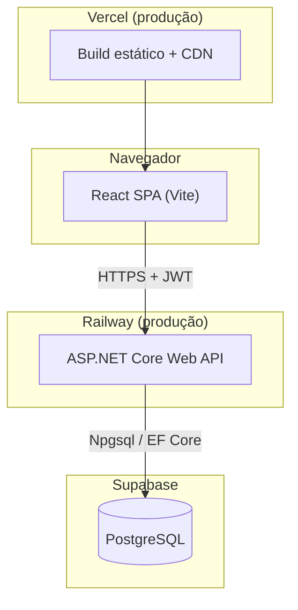
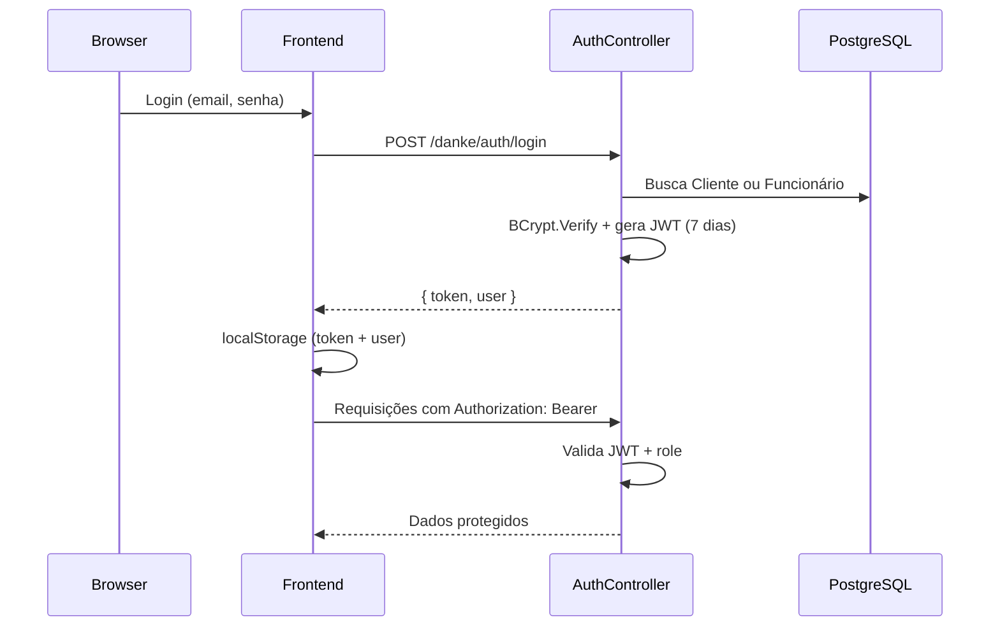
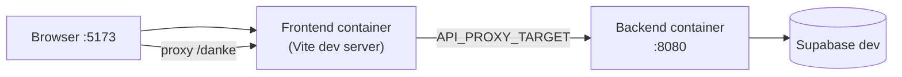

# Arquitetura do Sistema

## Visão geral

O projeto segue uma arquitetura **cliente-servidor em camadas**, com frontend SPA desacoplado do backend REST e banco PostgreSQL gerenciado externamente.



## Camadas e responsabilidades

| Camada | Tecnologia | Responsabilidade |
|---|---|---|
| **Apresentação** | React 19 + Vite | UI, rotas, validação de formulários, persistência de sessão no browser |
| **API** | ASP.NET Core 10 | Autenticação, autorização, regras de negócio, exposição REST |
| **Persistência** | EF Core + Npgsql | Mapeamento ORM, migrations, acesso ao PostgreSQL |
| **Banco** | PostgreSQL (Supabase) | Armazenamento relacional de clientes, funcionários e revisões |

## Comunicação entre camadas

### Prefixo da API

Todos os endpoints REST usam o prefixo `/danke/` (ex.: `POST /danke/auth/login`, `GET /danke/revisao/cliente`).

### Formato de dados

- Request/response em **JSON**
- Propriedades em **camelCase** no wire format (configurado no backend)
- Datas armazenadas em **UTC** (`timestamp with time zone`) e convertidas para exibição local no frontend

### Autenticação



## Ambientes

### Desenvolvimento local (Docker Compose)



**Decisão:** no Docker, o browser **não** chama `localhost:8080` diretamente. O Vite faz **proxy** de `/danke` e `/health` para o serviço `backend:8080` na rede interna do Compose. Isso evita problemas de CORS e de porta não publicada no host.

### Produção

| Serviço | Provedor | Branch |
|---|---|---|
| Frontend | Vercel | `production` |
| Backend | Railway | `production` |
| Banco | Supabase | instância de produção |

O frontend em produção usa `VITE_API_URL` apontando para a URL pública do Railway (sem proxy do Vite).

## Estrutura de diretórios

```
danke-motorsport/
├── frontend/           # SPA React
│   └── src/
│       ├── components/
│       ├── contexts/
│       ├── pages/
│       ├── routes/
│       ├── services/
│       ├── styles/
│       └── utils/
├── backend/            # Web API
│   ├── Controllers/
│   ├── Data/
│   ├── Models/
│   ├── Services/
│   └── Migrations/
├── docs/               # Esta documentação
└── docker-compose.yml
```

## Health check e observabilidade

- Endpoint `GET /health` retorna `{ "status": "healthy" }`
- Usado pelo healthcheck do Docker Compose e pelo deploy no Railway
- Swagger disponível apenas em `Development` (`/swagger`)

## Decisões arquiteturais transversais

| Decisão | Motivação |
|---|---|
| Monorepo frontend + backend | Facilita desenvolvimento acadêmico em equipe e Docker Compose unificado |
| Supabase como PostgreSQL gerenciado | Evita operar banco local; tier gratuito adequado ao MVP |
| JWT stateless | Simplicidade de escala horizontal no backend sem store de sessão |
| Sem fila/mensageria | MVP síncrono; volume de agendamentos não exige processamento assíncrono |
| CSS puro (sem Tailwind/Bootstrap) | Controle fino do visual Swiss Design alinhado à marca Danke |

## Referências

- [Frontend — decisões detalhadas](./frontend.md)
- [Backend — decisões detalhadas](./backend.md)
- [Banco de Dados — schema e migrations](./banco-de-dados.md)
