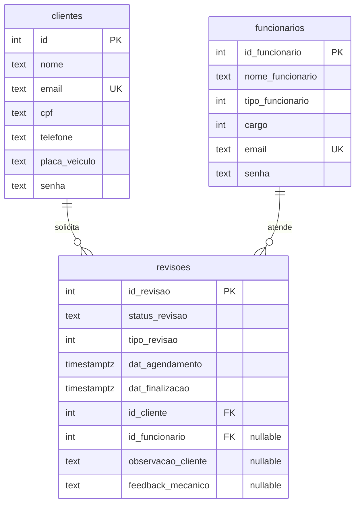
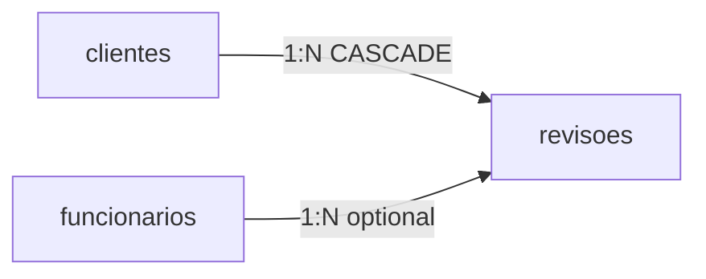

# Banco de Dados — Modelo e Decisões

## Visão geral

| Aspecto | Decisão |
|---|---|
| SGBD | **PostgreSQL 15+** |
| Hospedagem | **Supabase** (dev e produção em instâncias separadas) |
| Acesso | Connection string via variável de ambiente |
| ORM | Entity Framework Core (Code First) |
| Naming | Tabelas e colunas em **snake_case** no banco; classes C# em **PascalCase** |

## Diagrama entidade-relacionamento



## Tabelas

### `clientes`

Usuários finais que agendam revisões.

| Coluna | Tipo | Nullable | Descrição |
|---|---|---|---|
| `id` | `integer` | PK, identity | Identificador |
| `nome` | `text` | NOT NULL | Nome completo |
| `email` | `text` | NOT NULL, **UNIQUE** | Login e contato |
| `cpf` | `text` | NOT NULL | Documento (máscara no frontend) |
| `telefone` | `text` | NOT NULL | Contato |
| `placa_veiculo` | `text` | NOT NULL | Placa do veículo (pode ser vazia no cadastro) |
| `senha` | `text` | NOT NULL | Hash BCrypt |

**Decisão:** e-mail único garantido por índice (`HasIndex(c => c.Email).IsUnique()` em `AppDbContext`).

---

### `funcionarios`

Equipe interna (mecânicos e administradores).

| Coluna | Tipo | Nullable | Descrição |
|---|---|---|---|
| `id_funcionario` | `integer` | PK, identity | Identificador |
| `nome_funcionario` | `text` | NOT NULL | Nome |
| `tipo_funcionario` | `integer` | NOT NULL | `1` = Admin, outros = Operador |
| `cargo` | `integer` | NOT NULL | Código de cargo (domínio interno) |
| `email` | `text` | NOT NULL, **UNIQUE** | Login |
| `senha` | `text` | NOT NULL | Hash BCrypt |

**Decisão:** admin não é tabela separada — distinção via `tipo_funcionario`, refletida na claim JWT `Admin`.

---

### `revisoes`

Agendamentos de serviço (núcleo do domínio).

| Coluna | Tipo | Nullable | Descrição |
|---|---|---|---|
| `id_revisao` | `integer` | PK, identity | Identificador |
| `status_revisao` | `text` | NOT NULL | `Pendente`, `Em Andamento`, `Concluído` |
| `tipo_revisao` | `integer` | NOT NULL | `1` Bronze, `2` Silver, `3` Gold |
| `dat_agendamento` | `timestamptz` | NOT NULL | Data/hora desejada (UTC) |
| `dat_finalizacao` | `timestamptz` | NOT NULL | Placeholder na criação; atualizado ao concluir |
| `id_cliente` | `integer` | FK → `clientes.id` | Cliente solicitante |
| `id_funcionario` | `integer` | FK → `funcionarios.id_funcionario`, **NULL** | Mecânico atribuído |
| `observacao_cliente` | `text` | NULL | Sintomas / pedidos do cliente |
| `feedback_mecanico` | `text` | NULL | Diagnóstico / serviço realizado |

## Relacionamentos e integridade



| FK | Comportamento ON DELETE | Motivo |
|---|---|---|
| `revisoes.id_cliente → clientes.id` | **CASCADE** | Remover cliente remove suas revisões |
| `revisoes.id_funcionario → funcionarios.id_funcionario` | **NO ACTION** (default) | Evita cascade acidental ao remover funcionário |

**Decisão:** `id_funcionario` nullable — revisão nasce sem mecânico atribuído (`Pendente`) e recebe atribuição na primeira interação do funcionário.

## Domínios codificados (sem tabelas lookup)

### `status_revisao` (text)

| Valor | Significado |
|---|---|
| `Pendente` | Aguardando atendimento |
| `Em Andamento` | Mecânico trabalhando |
| `Concluído` | Serviço finalizado |

### `tipo_revisao` (integer)

| Valor | Plano |
|---|---|
| 1 | Bronze — revisão básica |
| 2 | Silver — revisão completa |
| 3 | Gold — diagnóstico avançado |

### `tipo_funcionario` (integer)

| Valor | Role JWT |
|---|---|
| 1 | Admin |
| ≠ 1 | Funcionario |

**Decisão:** valores mágicos em colunas simples — adequado ao MVP acadêmico; evolução natural seria tabelas `planos`, `status` e `cargos` com seed.

## Tratamento de datas

- Colunas: `timestamp with time zone` (`timestamptz`)
- Backend persiste em **UTC** (`ToUniversalTime()`)
- Validação de horário comercial usa fuso **`America/Sao_Paulo`**
- Frontend exibe com `toLocaleDateString('pt-BR')`

## Histórico de migrations

| Migration | Data (nome) | Alteração |
|---|---|---|
| `SetupInicial` | 20260412140507 | Cria `clientes`, `funcionarios`, `revisoes` com FKs |
| `AddAuthAndNullableEmployee` | 20260606192336 | Adiciona `email`/`senha` em clientes e funcionários; `id_funcionario` nullable |
| `AddUniqueEmailConstraints` | 20260618221734 | Índices UNIQUE em `clientes.email` e `funcionarios.email` |
| `AddObservacaoAndFeedbackToRevisoes` | 20260619004942 | Colunas `observacao_cliente` e `feedback_mecanico` |

### Aplicar migrations

```bash
# Via Docker
docker compose run --rm backend dotnet ef database update

# Manual
cd backend
dotnet ef database update
```

## Tabela de controle EF

`__EFMigrationsHistory` — registrada automaticamente pelo EF Core; não alterar manualmente.

## Seed e primeiro admin

Não há seed automático no código. O primeiro administrador é inserido manualmente via SQL no Supabase:

```sql
INSERT INTO funcionarios (nome_funcionario, tipo_funcionario, cargo, email, senha)
VALUES ('Admin', 1, 1, 'admin@exemplo.com', '<bcrypt-hash>');
```

O hash BCrypt deve ser gerado com a mesma biblioteca do backend (`BCrypt.Net`).

## Keep-alive (Supabase free tier)

Workflow GitHub Actions (`.github/workflows/keepalive.yml`) executa `SELECT 1` a cada 5 dias para evitar pausa do banco por inatividade no tier gratuito.

## Evoluções futuras sugeridas

| Melhoria | Benefício |
|---|---|
| Tabela `planos` | Preços, descrições e duração configuráveis |
| Índice em `revisoes.dat_agendamento` | Consultas de agenda por período |
| CHECK constraint em `status_revisao` | Integridade no banco além da aplicação |
| Soft delete (`deleted_at`) | Auditoria sem perder histórico |
| Tabela `horarios_bloqueados` | Feriados e exceções ao horário comercial |
